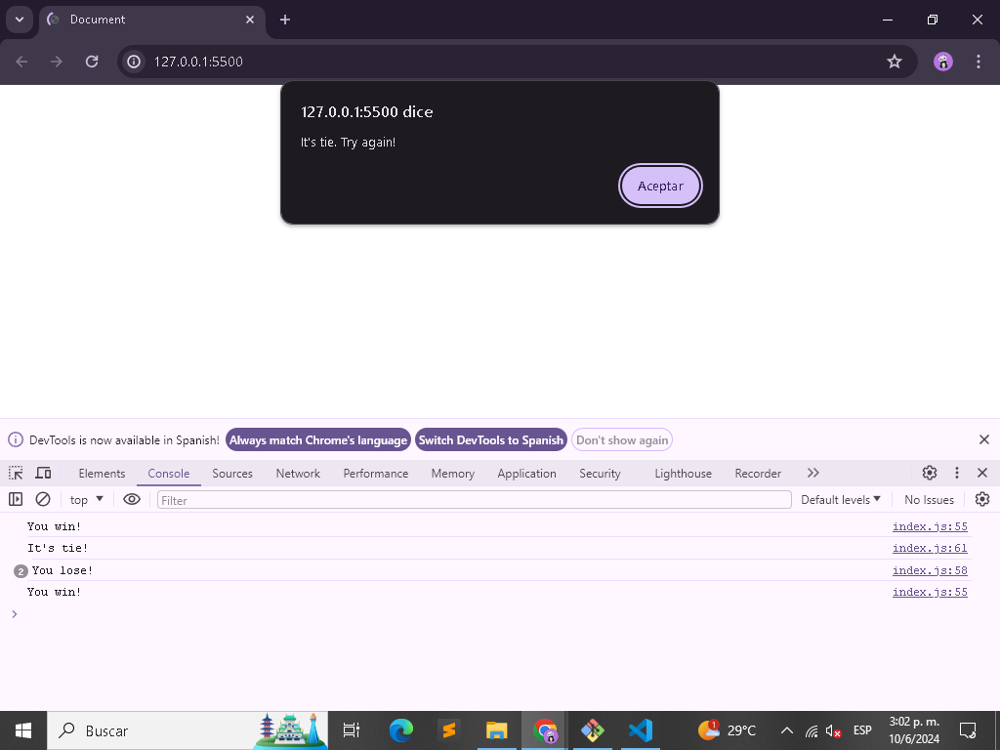

# Project Name

> A new repository was created for the Odin Porject project "Project: Rock Paper Scissors". Rock Paper Scissors (also known as Rochambeau, Roshambo or Janken) is an easy and fun sleight-of-hand game that anyone can learn and enjoy. It's a great way to make minor decisions when you and a friend can't agree on something, or even just an entertaining way to pass the time. The great thing about the game is that almost anyone can learn the rules in a matter of seconds.

Additional description about the project and its features.

## Built With

- Major languages: HTML, CSS & JS.
- Technologies used: Linux, Git Bash.

## Live Demo

[Live Demo Link](https://vxnec0de.github.io/project_rock_paper_scissors_odinProject/)

## Getting Started

**Clone the repository in Git and run it from a browser..**

## Authors

👤 **Vanessa Carolina Rubio Cheing**

- GitHub: [@VxneC0de](https://github.com/VxneC0de)
- Instagram: [@v_rc20](https://www.instagram.com/v_rc20/)
- LinkedIn: [LinkedIn](https://www.linkedin.com/in/vanessa-rubio-7b7492293/)

## 🤝 Contributing

Contributions, issues, and feature requests are welcome!

Feel free to check the [issues page](https://github.com/VxneC0de/project_rock_paper_scissors_odinProject/issues).

## Show your support

Give a ⭐️ if you like this project!

## Acknowledgments

- Inspiration: https://www.theodinproject.com/lessons/foundations-rock-paper-scissors

## 📝 License

This project is [CC0 1.0 Universal](LICENSE) licensed.